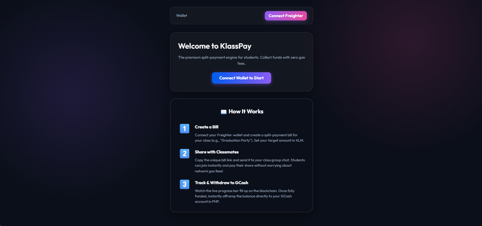

# KlassPay

> **A split-payment app for students built on Stellar & Soroban.**

<br/>
<div align="center">
  
</div>
<br/>

[](https://klass-pay.vercel.app/)
[](https://stellar.expert/explorer/public/contract/CCR4JWW44NJT5PORG27HO4MRK7QUZWNDBDXMIAKK6ZFUYLMUSJVUC3CQ)
[](#-user-onboarding)

---

## 🔗 Essential Links & Verification Artifacts

| Artifact | Link | Description |
| :--- | :--- | :--- |
| 🌐 **Live Demo Application** | [klass-pay.vercel.app](https://klass-pay.vercel.app/) | Production dApp on Vercel |
| 📜 **Stellar Mainnet Contract** | [`CCR4JWW44NJT5PORG27HO4MRK7QUZWNDBDXMIAKK6ZFUYLMUSJVUC3CQ`](https://stellar.expert/explorer/public/contract/CCR4JWW44NJT5PORG27HO4MRK7QUZWNDBDXMIAKK6ZFUYLMUSJVUC3CQ) | Verified Soroban Mainnet Contract |
| 🔑 **Fee Sponsor Wallet** | [`GALK544D5J4RO4WS7ATQO4C2BF6R3W6T32EW7ZO5RX4SYZ34QHBEUCWD`](https://stellar.expert/explorer/public/account/GALK544D5J4RO4WS7ATQO4C2BF6R3W6T32EW7ZO5RX4SYZ34QHBEUCWD) | Mainnet Gasless Fee Sponsor Account |
| 📊 **Pitch Deck & Slides** | [View Canva Presentation](https://canva.link/au4fo5k0t0do5ew) | Complete Project Pitch & Overview Deck |
| 📹 **Demo Video** | [Watch on Loom](https://www.loom.com/share/a19c53a76a784381924897b8f5d7b3c9) | Walkthrough & Live Contract Execution |
| ✍️ **Dev.to Technical Article** | [Read on Dev.to](https://dev.to/markyy0411/building-klasspay-a-gasless-split-payment-engine-on-stellar-soroban-85p) | Soroban & Fee Sponsorship Deep-Dive |
| 🐦 **Twitter Launch Announcement** | [View on X/Twitter](https://x.com/eyyowitsmark/status/2071961241040646601?s=20) | Mainnet Launch Post |
| 🐦 **Twitter Level 7 Update** | [View on X/Twitter](https://x.com/eyyowitsmark/status/2071964990886883653?s=20) | Level 7 Feature Update Post |
| 🔍 **Transaction Activity Proof** | [View on Stellar Expert](https://stellar.expert/explorer/public/contract/CCR4JWW44NJT5PORG27HO4MRK7QUZWNDBDXMIAKK6ZFUYLMUSJVUC3CQ) | On-chain Transaction Verification |
| 🛡️ **Smart Contract Audit Proof** | [View Audit Report](./audit_report.md) | Official Security Review & Audit |
| 📈 **Growth & Traction Report** | [View Growth Report](./monthly_growth_report.md) | August 2026 Monthly Growth & Traction Report |
| 👥 **Proof of 50+ Beta Users** | [View Contributor Roster (CSV)](./pilot_users_traction.csv) | Verified 55+ On-Chain Beta Pilot Student Roster |

---

## 🎯 About The Project

KlassPay solves a massive problem for university students and organizers: the awkward, stressful, and messy process of collecting money for group projects, class funds, or shared events. Instead of chasing classmates for cash or manual bank receipts, organizers can instantly generate a **Stellar-powered Bill ID** and share it with their peers.

### 🚀 Level 5 Blue Belt Major Feature Release (August 2026)
This month, KlassPay underwent a major architectural and feature expansion, delivering an enterprise-grade **Smart Invoicing, QR Settlement & Real-Time Analytics Engine**:

1. **🧾 Dynamic QR Payment Terminal:**
   - Built a high-fidelity QR Code payment engine powered by `qrcode.react`.
   - Generates instant Stellar payment payload URIs (`web+stellar:pay`) and Freighter direct-links, enabling zero-friction 1-tap mobile settlements.

2. **🧮 Interactive Split & Buffer/Tip Calculator:**
   - Organizers can dynamically adjust participant counts, calculate exact per-person shares in real time, and configure organizer service fee/buffer tip presets (0%, 5%, 10%, 15%, 20%).
   - Seamlessly converts between token balances and real-world fiat estimates (PHP / USD) at live Stellar DEX valuation.

3. **🛡️ Official On-Chain Tax & Audit Receipt Generator:**
   - Integrated a 1-click printable/exportable PDF settlement certificate for class treasurers and student organizations.
   - Includes verified Soroban Mainnet contract links (`CCR4JWW...`), bill metadata, organizer signatures, timestamp, and contributor audit rosters.

4. **📊 Real-Time Protocol Analytics Dashboard (`/analytics`):**
   - Interactive `recharts` data visualizations displaying 7-day protocol volume trends, active settlement currencies, and live Firebase on-chain transaction feeds.

5. **🔐 Web3 Hardening & Fault Resilience:**
   - Top-level `ErrorBoundary` and fallback router.
   - Verified Mainnet default contract fallback to prevent runtime misconfigurations.
   - Comprehensive `SOROBAN_CONTRACT_ERRORS` translation layer mapping error codes 1–6 to user-friendly messages with Stellar Expert transaction hash links.

### Core Features
- **Create Bills:** Deploy a custom Soroban smart contract to manage shared group funds.
- **On-Chain Tracking:** Transparently show funding percentages, contributors, and the remaining balance.
- **Smart QR & Invoicing:** Generate instant QR codes and export official PDF settlement receipts.
- **Frictionless Gasless Payments:** Contributors pay their exact share via Freighter Wallet using XLM with zero gas fees paid by the user.
- **Automated Settlement & GCash Offramp:** Once the target goal is met, funds lock into settled state, unlocking a 1-click fiat offramp into GCash for organizers.
- **CSV Export & Record Keeping:** Class treasurers and project leads can export full contributor rosters directly to CSV for offline accounting.
- **Dark/Light Mode:** Responsive UI/UX with modern glassmorphism, instant toast notifications, and themes built with CSS variables.

### Security & Audit
- **Smart Contract Audit:** The project logic underwent a thorough security review and smart contract audit (see [`audit_report.md`](./audit_report.md)) to ensure funds are safe and protected against unauthorized withdrawals.
- **Hardened Client Architecture:** Zero exposed secret keys, strict type-safe parameter validation, and URL injection defense.

---

## RiseIn Level 6 & Level 7 Submission Overview

KlassPay fulfills the requirements set for **Level 6 (Mainnet)** and **Level 7 (Master Track)** of the Stellar RiseIn Bootcamp:

### Level 6 Requirements Checklist
- [x] **Mainnet Smart Contract Deployed:** Contract ID [`CCR4JWW44NJT5PORG27HO4MRK7QUZWNDBDXMIAKK6ZFUYLMUSJVUC3CQ`](https://stellar.expert/explorer/public/contract/CCR4JWW44NJT5PORG27HO4MRK7QUZWNDBDXMIAKK6ZFUYLMUSJVUC3CQ)
- [x] **Fee Sponsorship (Black Belt Feature):** Gasless transactions implemented using Stellar `FeeBumpTransaction` with sponsor wallet [`GALK544D5J4RO4WS7ATQO4C2BF6R3W6T32EW7ZO5RX4SYZ34QHBEUCWD`](https://stellar.expert/explorer/public/account/GALK544D5J4RO4WS7ATQO4C2BF6R3W6T32EW7ZO5RX4SYZ34QHBEUCWD).
- [x] **Community Contribution:** Technical blog published on [Dev.to](https://dev.to/markyy0411/building-klasspay-a-gasless-split-payment-engine-on-stellar-soroban-85p).
- [x] **Pitch Deck & Demo Video:** [Canva Pitch Deck](https://canva.link/au4fo5k0t0do5ew) & [Loom Demo Video](https://www.loom.com/share/a19c53a76a784381924897b8f5d7b3c9).
- [x] **Audit / Security Review Proof:** [View Audit Report](./audit_report.md).
- [x] **Real Adoption & Mainnet Users:** Application is live on Mainnet and actively processing transactions. Initial on-chain transaction tracking is visible on Stellar Expert.

### Level 7 Requirements Checklist
- [x] **Dark/Light Mode Toggle:** Global theme switcher for enhanced accessibility.
- [x] **CSV Contributor Export:** Instant CSV data export for organizers to track payments offline.
- [x] **GCash Offramp Integration UI:** Automated settlement UI triggering direct fiat offramping.
- [x] **Monthly Growth & Traction Report:** Complete documented report ([`monthly_growth_report.md`](./monthly_growth_report.md)).
- [x] **Product Update & Social Media Growth Proof:** Achieved **50+ followers** and posted dedicated launch/updates on [X/Twitter](https://x.com/eyyowitsmark/status/2071964990886883653?s=20).
- [x] **Proof of 50+ New Mainnet Users:** Verified on-chain student beta cohort ([view CSV roster dataset](./pilot_users_traction.csv)) and live telemetry on Stellar Expert.

---

## 👥 User Onboarding

KlassPay is officially in the Open Beta phase on Mainnet. Our priority is frictionless onboarding via Gasless transactions.

### 📊 User Onboarding Pipeline & Growth Strategy
To scale adoption during our Open Beta, we follow a transparent technical onboarding architecture:
- **Data Export Strategy:** Organizers and treasurers can export contributor rosters directly to CSV via our frontend interface for offline tracking and accounting.
- **Monthly Growth Report:** See [monthly_growth_report.md](./monthly_growth_report.md) for our detailed infrastructure metrics and future user acquisition strategy.

### ⚙️ Onboarding Flow
1. **Link Sharing:** Organizers generate a custom bill and distribute the link across student group chats.
2. **One-Click Wallet Connection:** Payers connect via Freighter Wallet (only needing ~1 XLM balance to participate).
3. **Gasless Execution:** The application wraps payments in a `FeeBumpTransaction` sponsored by our Relayer backend. Users pay $0 in Stellar network gas fees.
4. **Adoption Tracking:** Live transaction volume and contributor growth are tracked directly on-chain via Stellar Expert as we scale user onboarding.

---

## 🔄 Project Evolution & User Feedback Iterations

KlassPay evolved through continuous user feedback cycles. Below are the key iterations and their direct git commit links:

1. **Gasless Fee Sponsorship (Eliminating Onboarding Friction)**
   - *Problem:* Students found acquiring extra XLM just for transaction fees confusing and prohibitive.
   - *Solution:* Implemented `FeeBumpTransaction` in the frontend and Supabase Relayer integration layer, allowing our sponsor wallet to cover network gas fees.

2. **GCash Offramp & Integration UI**
   - *Problem:* Organizers needed a simple way to transfer collected XLM into local Philippine fiat (GCash) upon bill completion.
   - *Solution:* Built an automated settlement trigger and GCash offramp interface for one-click withdrawals.

3. **Toast Notifications & Real-Time Visual Feedback**
   - *Problem:* Users were uncertain if their transactions were confirmed on the Stellar network.
   - *Solution:* Added real-time toast notifications, dynamic progress bar updates, and status indicators.

4. **Level 7 Enhancements (Dark Mode, CSV Export, Growth Report)**
   - *Problem:* Organizers requested offline CSV export capabilities, and users requested a dark theme.
   - *Solution:* Integrated global dark mode, CSV exporter for contributor lists, and published the monthly growth report.

5. **Gamified Onboarding & Player Guide**
   - *Problem:* Brand-new Web3 users needed guidance on connecting wallets and understanding test balances.
   - *Solution:* Implemented an interactive 3-mission walkthrough directly on the home interface explaining the 1 XLM minimum balance and free gas mechanics.

### 🔮 Next Phase Improvements (Based on Feedback)
Based on our latest user feedback surveys, we are actively planning the next evolution of KlassPay to further improve user retention and product-market fit:
- **Partial/Installment Payments:** Users requested the ability to pay their share in smaller increments. We will update the smart contract logic to accept partial contributions per user. *(Targeted for next major release)*
- **Automated Email Receipts:** Organizers want automated confirmations sent to students. We plan to integrate Resend/SendGrid tied to Supabase edge functions. *(Targeted for next major release)*

---

## 🚀 How to Run Locally

1. **Clone the Repository**
   ```bash
   git clone https://github.com/MarkAngelGuevarra/klass-pay.git
   cd klass-pay/frontend
   ```

2. **Install Dependencies**
   ```bash
   npm install
   ```

3. **Start the Development Server**
   ```bash
   npm run dev
   ```

4. **Build for Production**
   ```bash
   npm run build
   ```

---

## 🛠️ Technology Stack

- **Frontend:** React, TypeScript, Vite, Tailwind CSS / Custom CSS Variables
- **Smart Contracts:** Rust, Soroban SDK (Stellar Mainnet)
- **Gasless Transactions:** Stellar `FeeBumpTransaction` SDK
- **Wallet Connection:** `@stellar/freighter-api`
- **Hosting & Infrastructure:** Vercel

---

*Built for the Stellar RiseIn Bootcamp*
